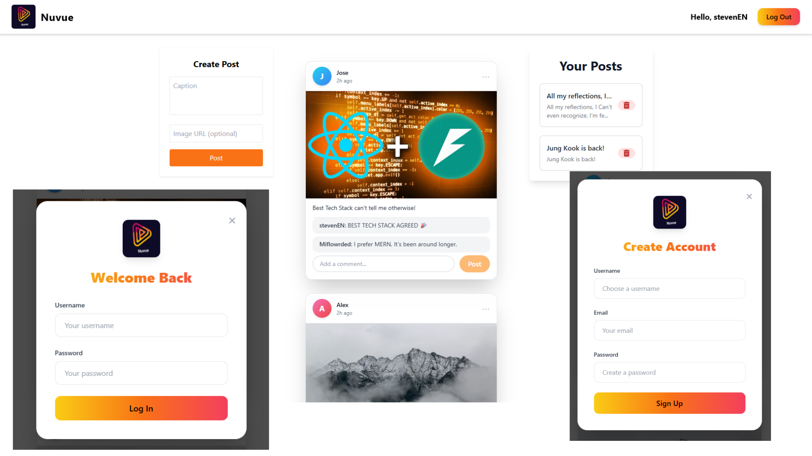

# 📸 Nuvue – Social Media App (FastAPI + React)

Nuvue is a fullstack Instagram-style social media app where users can register, log in, create posts, comment, and interact with a clean, responsive UI. Built with a FastAPI backend, React frontend, PostgreSQL database (hosted on Neon), and styled using TailwindCSS.

---

## 🖼️ Preview



---

## 🚀 Features

### 🔐 Authentication
- JWT-based login & registration
- Auth-protected API routes
- Password hashing with `bcrypt`

### 📷 Posts
- Create, view, and delete posts
- Upload image URLs
- Add captions
- Only post authors can delete

### 💬 Comments
- Comment on any post
- View your own and others' comments

### 🧑‍💻 Tech Stack

#### Backend (FastAPI)
- `FastAPI` – high-performance Python backend
- `SQLAlchemy` – ORM for PostgreSQL
- `psycopg2-binary` – PostgreSQL driver
- `passlib` + `bcrypt` – secure password hashing
- `python-jose` – JWT token management
- `python-dotenv` – environment variables
- `aiofiles` – async file handling
- `python-multipart` – image/form uploads
- `uvicorn` – ASGI server

#### Frontend (React)
- React + Hooks
- TailwindCSS – utility-first styling
- Fully responsive design
- Auth-aware routing and UI

---

## 🧪 Getting Started Locally

### 🖥 Backend

```bash
git clone https://github.com/yourusername/nuvue.git
cd nuvue/backend
python -m venv env
source env/bin/activate  # or env\Scripts\activate on Windows
pip install -r requirements.txt
```

### 🌐 Frontend

```bash
cd ../frontend
npm install
npm run dev

